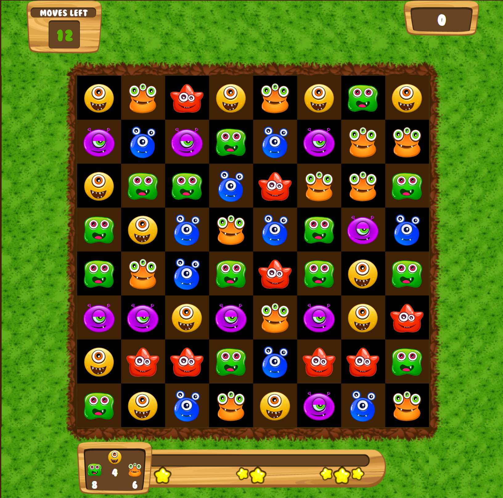

## match 3 game

This project demonstrates advanced techniques for writing applications in a declarative style.
We're using CSS animations, custom bindings, Sprite animations, SCSS and more to
implement a simple Candy Crush clone.

You can play the game in the browser here: [https://dukescript.com/match3/](https://dukescript.com/match3/)

To learn more about the techniques used in this demo, checkout these resources:

[Slideshare Presentation](https://www.slideshare.net/AntonEpple/crush-candy-with-dukescript)

[How to display a loading indicator](https://dukescript.com/best/practices/2017/03/07/loading.html)