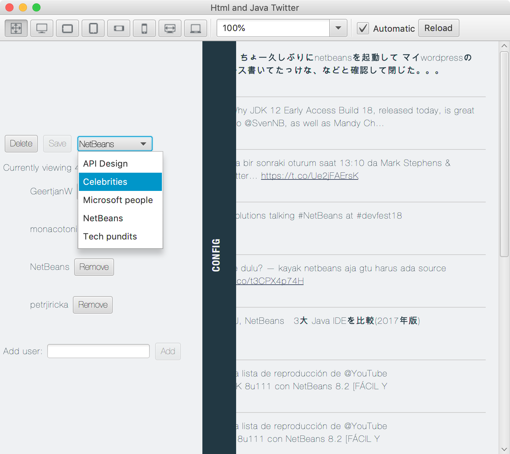
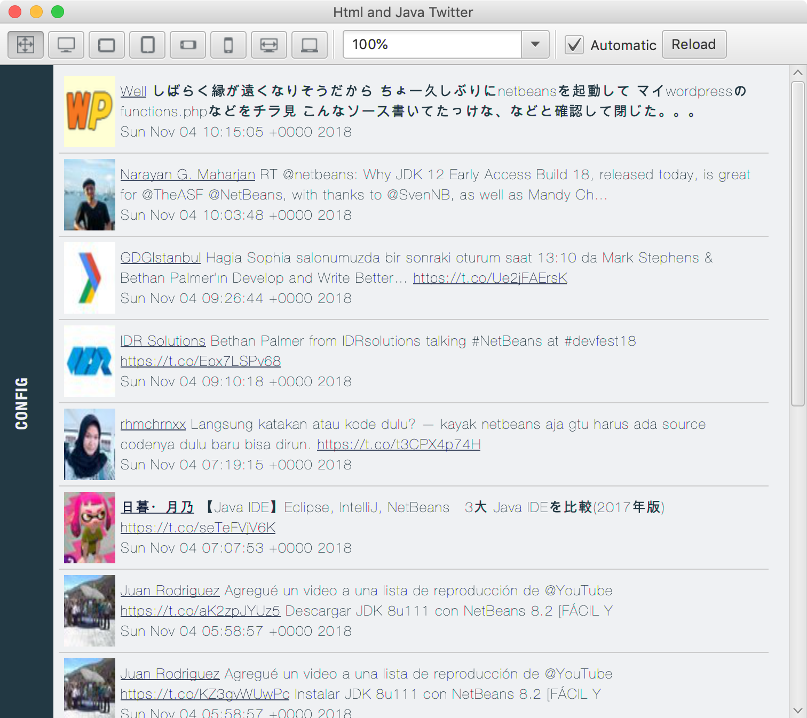

## Twitter Demo

This is a simple Twitter Client using the [twitter4j API](http://twitter4j.org/en/index.html).

The Application allows you to add Twitter users to category feeds:

Then it displays the Feed:

There's a (slightly outdated) [Blog entry about it's implementation](https://dukescript.com/best/practices/2015/05/17/twitter-demo.html)
